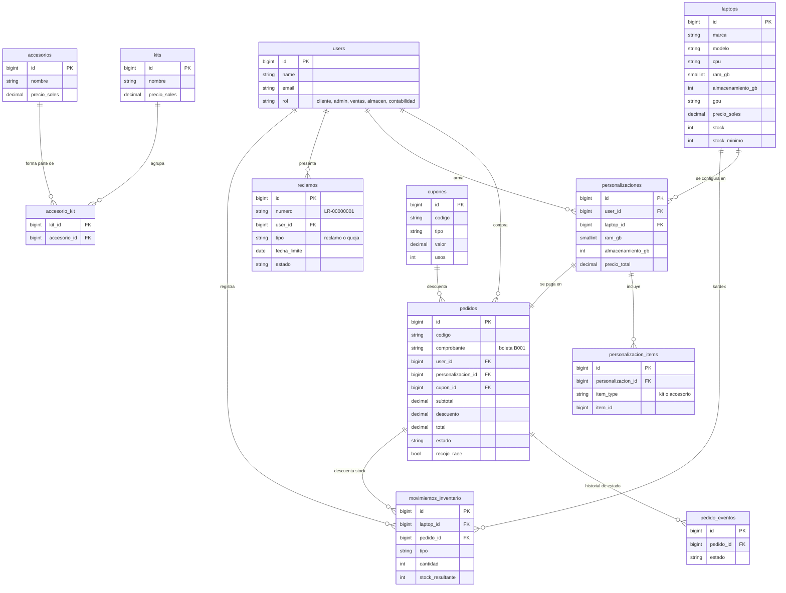
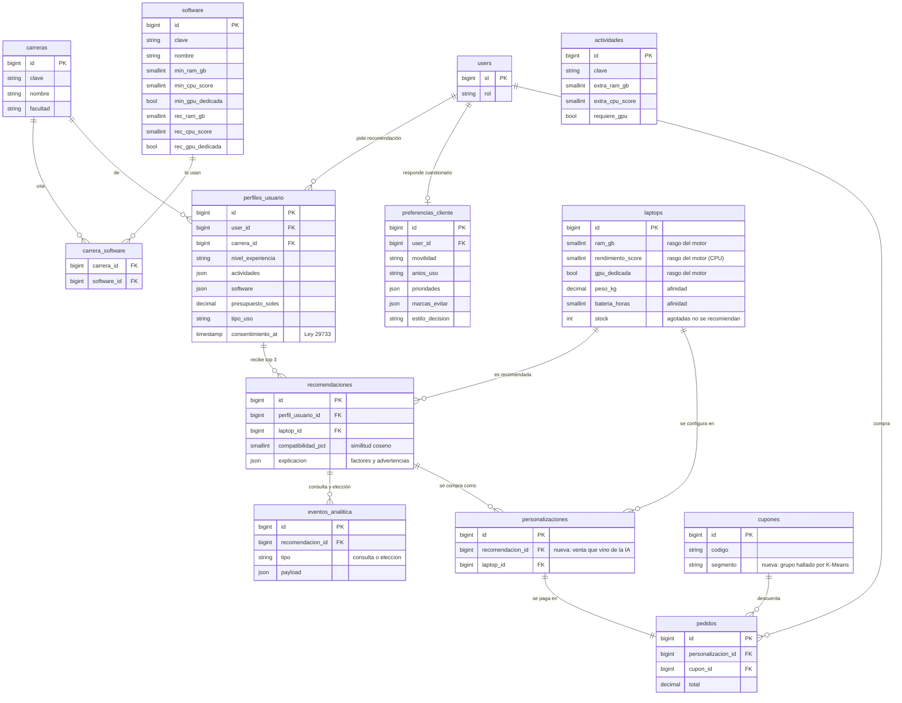
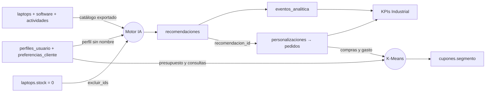

# Modelo de datos — antes y después de la IA

Qué tablas tendría IngeTech AI como **tienda de laptops sin IA** y qué agrega la **IA** encima.
Los diagramas salen del esquema real de PostgreSQL (`php artisan migrate`, octubre de 2026).

> **Transparencia:** el "antes" no es una versión anterior que haya existido. El sistema se
> diseñó con IA desde el inicio; el primer diagrama es la **misma tienda quitándole la IA**, para
> que se vea con claridad qué tablas y columnas existen solo por ella.

No se dibujan las 8 tablas internas de Laravel (`cache`, `cache_locks`, `jobs`, `job_batches`,
`failed_jobs`, `sessions`, `migrations`, `password_reset_tokens`): no son del negocio.

Imágenes listas para presentar: [antes](img/modelo-datos-antes.png) ·
[después](img/modelo-datos-despues.png) · [flujo de datos de la IA](img/flujo-datos-ia.png).

## Resumen

| | Antes (tienda sin IA) | Después (con IA) |
|---|---|---|
| Tablas del negocio | 12 | 20 (**+8**) |
| Qué sabe del cliente | Lo que compra | Lo que hace, qué programas usa, su presupuesto y cómo es |
| Cómo elige el cliente | Busca y compara solo | La IA le recomienda con % de compatibilidad y explica por qué |
| Qué mide la tienda | Ventas | Ventas + calidad de la recomendación + conversión de la IA |

## 1. Antes: tienda de laptops convencional

Catálogo, armado de la compra, pedidos y la gestión de la tienda (inventario, cupones,
reclamos). El cliente navega el catálogo y decide solo.

## 2. Después: la misma tienda con IA

Este diagrama muestra las **8 tablas nuevas** que existen por la IA y cómo se enganchan con la
tienda. Las tablas de la tienda siguen iguales (aquí se dibujan resumidas); solo ganan algunas
columnas que la IA necesita (ver la tabla de abajo).

## Qué agrega la IA, tabla por tabla

### Tablas nuevas (8)

| Tabla | Para qué la usa la IA |
|---|---|
| `carreras` | Punto de partida opcional del perfil: cada carrera trae sus programas típicos. |
| `software` | Requisitos mínimos y recomendados (RAM, CPU, GPU) de cada programa: el motor toma el más exigente. |
| `carrera_software` | Qué programas usa cada carrera. |
| `actividades` | Cuánto pide cada actividad (RAM extra, CPU, GPU). Es la entrada del **clasificador** (regresión logística) y del vector ideal. |
| `perfiles_usuario` | Lo que el cliente cuenta de sí: actividades, programas, presupuesto. Con la fecha de **consentimiento** (Ley 29733). Es la entrada del motor. |
| `preferencias_cliente` | Cuestionario de bienvenida (Psicología): mueve el 30% de **afinidad** del puntaje. |
| `recomendaciones` | Salida del motor: laptop, **% de compatibilidad** y **explicación** (factores y advertencias). |
| `eventos_analitica` | Consultas y elecciones: de aquí salen los **KPIs** de la IA (tasa de elección, tiempo de decisión, cobertura). |

### Columnas nuevas en tablas que ya existían

| Columna | Por qué |
|---|---|
| `laptops.rendimiento_score` | Puntaje de CPU (0–100) que el motor compara contra lo que piden las actividades y programas. Una tienda sin IA no lo necesita. |
| `laptops.gpu_dedicada` (como 0/1) | Rasgo del vector de la laptop en la similitud coseno. |
| `personalizaciones.recomendacion_id` | Enlaza la compra con la recomendación que la originó: permite medir **qué ventas vienen de la IA**. |
| `cupones.segmento` | Grupo de clientes al que apunta el cupón, descubierto por la **segmentación con K-Means**. |

### Columnas de la tienda que la IA lee (sin cambiarlas)

- `laptops.peso_kg`, `bateria_horas`, `pantalla_*`, `puertos`, `ram_ampliable_gb`: criterios de **afinidad** con el cuestionario.
- `laptops.stock`: las agotadas se envían al motor en `opciones.excluir_ids` y **no se recomiendan**.
- `pedidos` (cantidad y gasto por cliente) y `perfiles_usuario`: entrada de la **segmentación** de Marketing. El motor recibe solo números, sin nombre ni correo.

### Lo que la IA no guarda en la base de datos

- **El modelo entrenado** (`ml-engine/recommender/modelo_perfilado.joblib`): es un archivo del motor.
- **El catálogo que lee el motor** (`ml-engine/data/laptops.json` y `software.json`): se exporta desde estas tablas con `php artisan motor:exportar-catalogo`.
- **Los segmentos de clientes**: se calculan al abrir el panel de Marketing y no se almacenan, así no quedan perfiles de personas guardados.

## Cómo fluyen los datos por la IA

