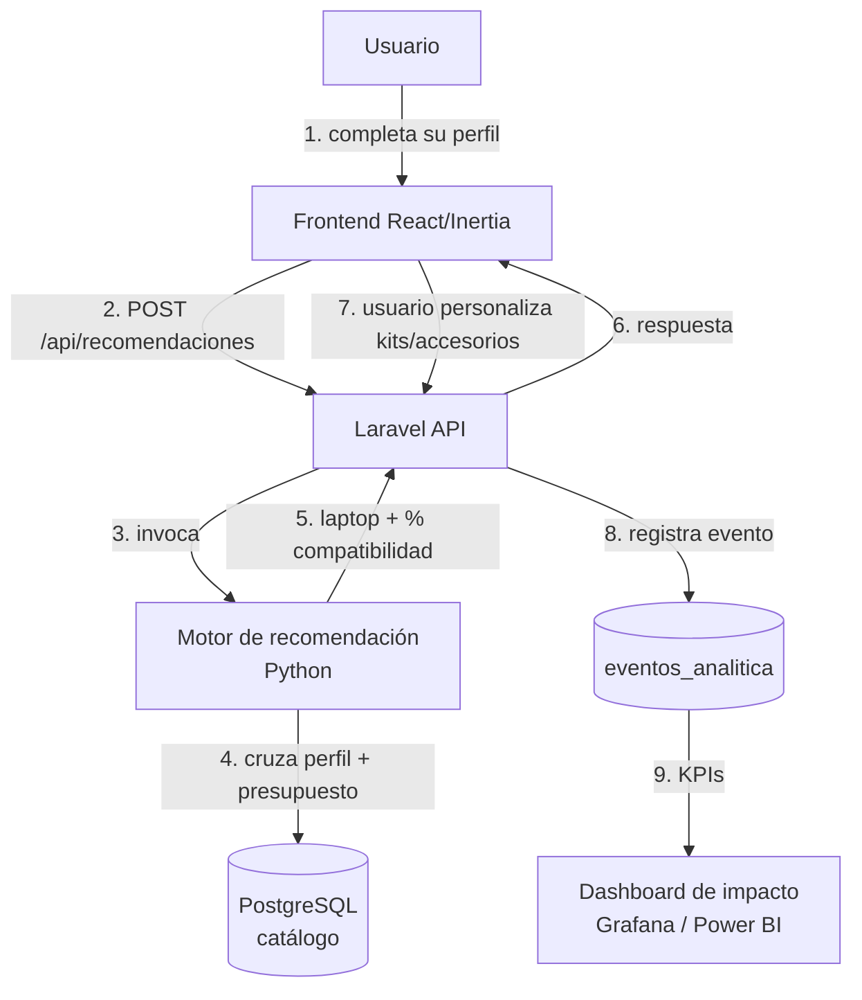
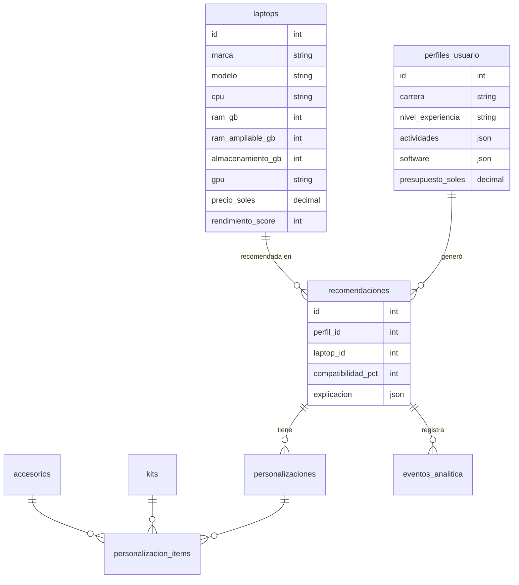

# Visión general de la arquitectura

## Idea del sistema

IngeTech AI **no le dice al usuario qué laptop comprar**: lo ayuda a elegir la configuración que
realmente necesita según lo que va a hacer con el equipo (programación, máquinas virtuales, IA,
desarrollo web, diseño/3D…).

## Flujo de punta a punta

## Componentes

| Componente | Tecnología | Carpeta | Módulo |
|---|---|---|---|
| Frontend del flujo | Inertia + React + Tailwind | `resources/js/Pages/` | B (Marco) |
| API + lógica de negocio | Laravel 11 | `app/` | A (Jack) |
| Motor de recomendación | Python + FastAPI | `ml-engine/` | A (Jack) |
| Base de datos | PostgreSQL 16 | `database/migrations/` | A + C |
| Catálogo (datos + admin) | Laravel + React | `database/seeders/`, `resources/js/Pages/Admin/Catalogo/` | C (Diego) |
| Analítica e impacto | eventos en BD + dashboard | `app/`, `analitica/` | A (Jack) |

## Cómo se comunican Laravel y el motor

El mismo código Python sirve en dos modos según el entorno (patrón heredado de *web-etabs*):

| Entorno | Cómo lo llama Laravel |
|---|---|
| **Local (Docker)** | El motor corre como servicio `uvicorn` en `http://ml-engine:5001`. Laravel hace un HTTP POST. |
| **Producción (Render)** | Laravel ejecuta `python ml-engine/cli_entry.py` como **subproceso corto**, le pasa el perfil por stdin y lee el JSON por stdout. Sin servidor persistente. |

`app/Services/Recommender/` encapsula esa decisión: el resto de Laravel solo llama a un método
`recomendar($perfil)` y no sabe cuál de los dos modos se usó.

El formato del JSON de entrada y salida está en [contrato-motor.md](contrato-motor.md). **Ese
contrato es sagrado**: si cambia, se actualiza el documento y se avisa a todo el equipo en el mismo PR.

## Base de datos (esquema inicial)

El detalle de cada tabla y sus migraciones lo maneja el módulo A (esquema base) y el módulo C
(tablas de catálogo: `laptops`, `accesorios`, `kits`).

## Decisiones ya tomadas

Ver [../adr/](../adr/):

- `0001` — Monorepo en vez de repos separados.
- `0002` — Laravel + Inertia/React + motor Python (por qué no todo FastAPI, por qué no todo Laravel).
- `0003` — Motor Python como subproceso en producción.
